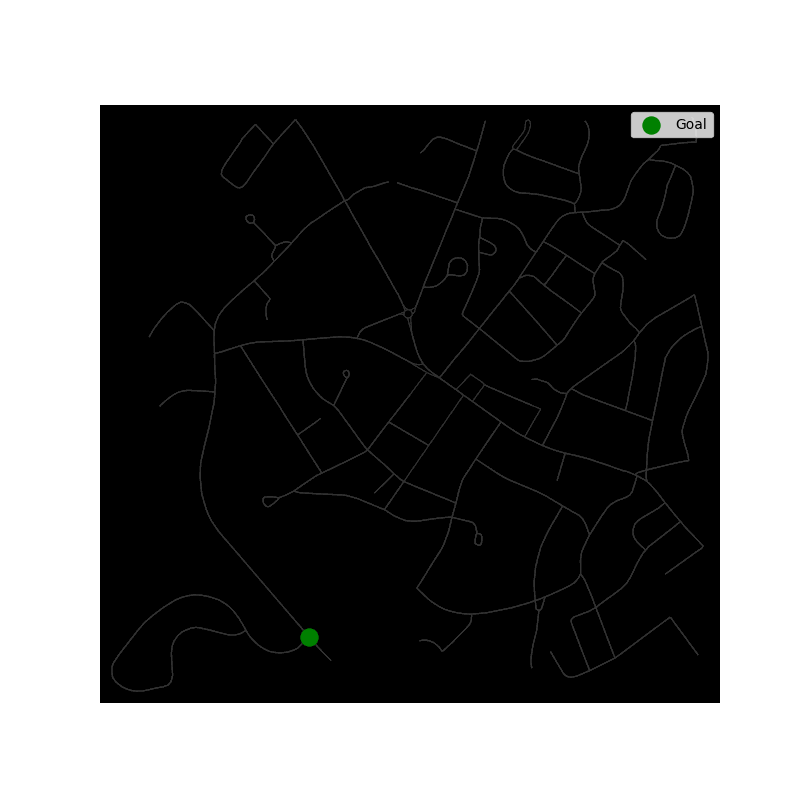
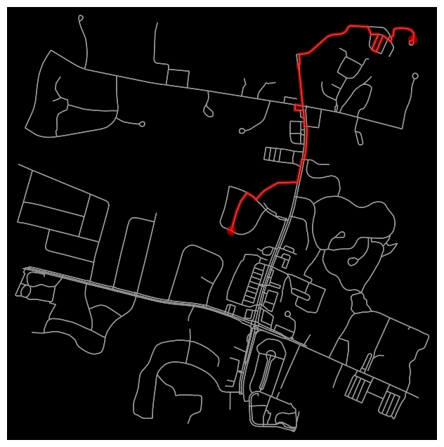
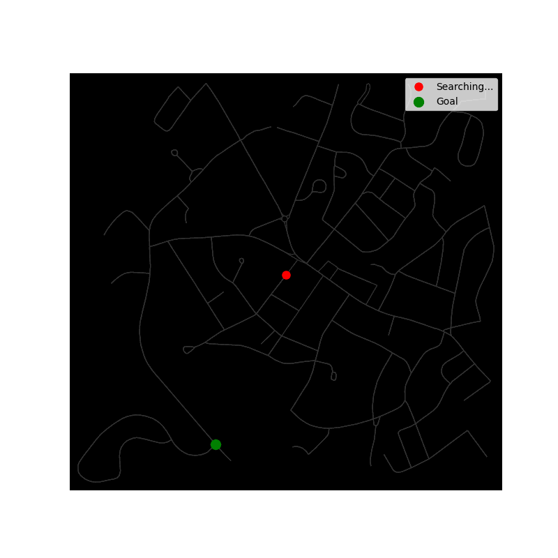

# Path Planning

## Dijkstras vs A*
Final visualization of the nodes and edges identified in the search + the most optimal path.

<table align="center">
  <tr>
    <th align="center">Dijkstra's Algorithm</th>
    <th align="center">A* Search</th>
  </tr>
  <tr>
    <td></td>
    <td></td>
  </tr>
</table>

---

## DFS example

### Static Path Result
Final visualization of the nodes and edges identified in the search.

  

---

### Exploration Animation
Step-by-step visualization of the DFS exploration and backtracking process.

  

